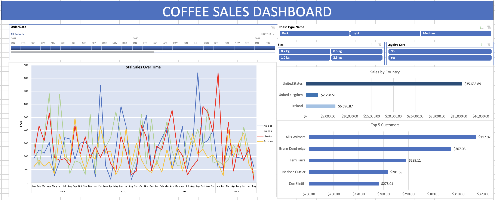

# Coffee Dashboard

## Project Overview
The Coffee Dashboard is an interactive Excel-based analytics tool designed to provide **actionable insights for a coffee shop business**.  
It allows users to track sales trends, analyze customer behavior, and monitor order patterns to inform strategic decisions. This dashboard project analyzes coffee sales data using pivot tables, XLOOKUP, INDEX, Slicers, and Timelines.

## Business Objective
- Monitor daily and monthly sales performance.
- Identify top-performing products and customers.
- Support data-driven decision-making for marketing and inventory planning.

## Coffee Dashboard Insights

### United States Leads Coffee Sales
The United States is the top contributor to global coffee sales revenue, surpassing all other countries.

### Liberica as Top Revenue Contributor
Liberica coffee generates the highest revenue among coffee types, highlighting its significant role in the market.

### Light Roast Coffee Outperforms Other Roasts
Among different roast types, light roast coffee leads in revenue generation.

### Coffee Sales by Country
- **Ireland:** Liberica coffee generates the highest revenue.  
- **United States:** Arabica coffee is the top revenue contributor.  
- **United Kingdom:** Robusta coffee leads in revenue generation.

### 2021 Sales Growth
Sales in 2021 increased by 13.6% compared to the previous year. While 2019 and 2020 had nearly identical sales figures, the 2021 surge reflects a strong and growing coffee market.

### Data Sources
The dashboard uses a dataset of coffee orders including:
- Customer ID and demographic information
- Order dates and times
- Products ordered and quantity
- Sales amounts

### Dashboard Features
- **Pivot Tables:** Summarize total sales by customer, product, and date.  
- **Pivot Charts:** Visualize trends in sales, orders, and product popularity.  
- **Interactive Slicers:** Filter by date, customer, and product to analyze specific segments.  
- **Timeline Filters:** Quickly explore daily, weekly, and monthly trends.  
- **Dynamic Metrics:** Automatically update metrics when new data is added.

### Tools & Skills
- Microsoft Excel: Pivot Tables, Pivot Charts, Slicers, Timelines
- Data visualization best practices
- Business reporting and dashboard design

#### Data
- The data is from Mo Chen's Youtube Channel.

## Screenshot

